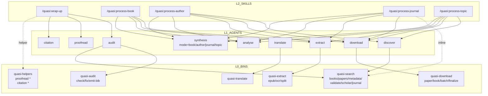

# Quasi 目标架构 — 落地参考

date: 2026-05-17
status: 落地依据
依据: `LAYERS.md` (设计决策) + `Quasi 当前结构 snapshot — 编辑用.md` (现状)

---

## 0. 总览(三层)

```
┌─────────────────────────── L2: SKILLS (5) ───────────────────────────────┐
│                                                                          │
│   /quasi:wrap-up           /quasi:process-book      /quasi:process-author │
│   /quasi:process-journal   /quasi:process-topic                          │
│                                                                          │
└──────────────────────────────────┬───────────────────────────────────────┘
                                   │ dispatch (主要) + 直调 (例外)
                                   ▼
┌─────────────────────────── L1: AGENTS (9 活跃) ───────────────────────────┐
│                                                                          │
│   analyse   synthesis   discover   download   extract   translate        │
│   proofread   citation   audit                                           │
│                                                                          │
│   (暂废: scan, setup)                                                     │
└──────────────────────────────────┬───────────────────────────────────────┘
                                   │ Bash call
                                   ▼
┌─────────────────────────── L0: BINS (6) ─────────────────────────────────┐
│                                                                          │
│   [agent-callable atomic]                                                │
│   quasi-search       quasi-audit        quasi-download                   │
│   quasi-extract      quasi-translate                                     │
│                                                                          │
│   [skill-orchestration helpers]                                          │
│   quasi-helpers   ← proofread + citation 等所有 skill helper 聚合于此    │
│                                                                          │
└──────────────────────────────────────────────────────────────────────────┘
```

---

## 1. BINS (L0) — 6 个

bin 分两类: **agent-callable atomic**(5 个,给 agent 编排用) + **skill-orchestration helpers**(1 个,给 skill 主进程用)。

### 1.1 Agent-callable atomic bins (5)

| bin | subcommand | 干什么 |
|---|---|---|
| **`quasi-search`** | `books` · `papers` · `metadata` · `validate` *(现有)* · **`scholar`** *(新)* · ~~`journal`~~ *(推后)* | 多源搜索: books/papers 各自引擎; metadata 多源 fallback chain (CR/AA/OL,**吸收 bts/scripts 8 脚本**); validate 校 manifest DOI; **scholar** 走 dokobot 调 Google Scholar 兜底; **`journal` subcmd 跟 process-journal 一起推后** |
| `quasi-audit` | `check` · `fix` · `emit-bib` | vault schema 校验 / 机械修复 / 全量 biblio 派生 |
| **`quasi-download`** | **`paper` · `book` · `batch` · `finalize`** | by intent 分: 单篇论文/单本书/manifest 批量/finalize 一本书。每个 subcommand 内部跑各自的 fallback chain(paper: OA→EZProxy→Wayback; book: AA→md5→ISBN) |
| `quasi-extract` | `epub` · `ocr` · `split` | 三 subcommand 各自对应一个引擎: epub → 章节 md / PDF OCR → md / md 或 PDF → 切章节 |
| `quasi-translate` | (default) | PDF 沉浸式翻译 |

### 1.2 Skill-orchestration helpers (1)

| bin | subcommand | 干什么 |
|---|---|---|
| **`quasi-helpers`** | `proofread split\|init\|cleanup` · `citation parse\|resolve\|render\|emit-bib` | **聚合所有 skill 主进程要直调的 helper 操作**。nested 二级 subcommand。**LLM 通过 bin 比裸 script 稳定得多**,所以即便是 skill 用也封装成 bin |

**已砍/合**(本轮):
- ~~`quasi-proofread`~~ → 进 `quasi-helpers proofread {split,init,cleanup}`
- ~~`quasi-citation`~~ → 进 `quasi-helpers citation {parse,resolve,render,emit-bib}`

**推后**(整条 journal 链): `quasi-journal-fetch` · `quasi-journal-report` 保持现状,跟 process-journal skill + scan-agent 一起后续重做

**emit-bib 同名分域** (仍成立):
- `quasi-audit emit-bib` → 全 vault biblio
- `quasi-helpers citation emit-bib` → 单 draft biblio
- 都是 vault frontmatter 的派生 view,**无独立 cache**

### 1.3 为什么有 "helper bin"

按 §1 三层模型, skill 应该只 dispatch agent, 不直调 bin。**`quasi-helpers` 是这个规则的明确例外**:

1. 有些 skill workflow 是 **map-reduce 形态**: deterministic setup → 并行 agent map → deterministic teardown。
2. setup/teardown 是 skill 级别的协调(切节、建/清记录块、parse/render 等),没法塞进 agent(放进去会破坏 map 的并行)。
3. **不能直接让 skill 调 raw script** —— 实测 LLM 调 bin 比 script 稳定得多(env 注入、`--help` 提示)。
4. 解决: 单独一个 `quasi-helpers` bin 聚合所有此类操作,**标记为"skill 用,不给 agent 用"**。

---

## 2. AGENTS (L1) — 9 个活跃 + 2 个暂废

### 2.0 两种 agent-bin 关系

agent 跟 bin 只有**两种合法关系**(Pattern B 已被 `quasi-helpers` 化解):

| 模式 | 描述 | 例子 |
|---|---|---|
| **A. agent 包 bin** | agent 主要工作就是调它那个 bin (1:1 或 1:N)。agent 是 bin 的 LLM 编排壳 | download-agent → quasi-download; extract-agent → quasi-extract; audit-agent → quasi-audit + quasi-search |
| **C. 纯 LLM agent** | 不调任何 bin | analyse; synthesis; proofread; citation |

> **proofread-agent 和 citecheck-agent 是 Pattern C**: 它们做 LLM 工作(in-place edit / 校引用判断),不调 bin。
> 它们对应的 setup/teardown 操作(切节、parse/render 等)由 wrap-up skill 调 **`quasi-helpers`** 完成 —— 详见 §1.2 / §1.3。

### 2.1 Agent → Bin 调用表

| agent | 调的 bin | 模式 | 备注 |
|---|---|---|---|
| `analyse-agent` | — | **C** | 纯 LLM,per-section 分析 |
| `synthesis-agent` (大一统) | — | **C** | 纯 LLM,caller 传 `mode = book \| author \| journal \| ...`。吸收原 overview/profile/synthesis |
| `discover-agent` | `quasi-search` | **A** | 给定搜索关键词找结果并结构化输出。剥离了 inline search,改调 bin |
| `download-agent` | `quasi-download {paper\|book\|batch\|finalize}` | **A** | agent 按 intent 选 subcommand |
| `extract-agent` | `quasi-extract {epub\|ocr\|split}` | **A** | agent 按文件类型选 subcommand |
| `translate-agent` | `quasi-translate` | **A** | PDF 翻译 |
| `proofread-agent` | — | **C** | 纯 LLM in-place edit;skill 走 `quasi-helpers proofread *` 做 setup/teardown |
| `citecheck-agent` | — | **C** | 纯 LLM 校 draft 引用 + 主题契合判断;skill 走 `quasi-helpers citation *` 做 setup/teardown |
| **`audit-agent`** | **`quasi-audit` + `quasi-search`** | **A 扩展** | 本地 check/fix/emit + 调 search 拿多源元数据 + agent 内做本地清洗/字段合并/回写 |
| ~~`scan-agent`~~ | — | — | **暂废,本轮保留文件**;跟 journal 链一起后续重做 |
| ~~`setup-agent`~~ | — | — | **暂废**,后续重构 |

### 2.2 Agent 存在理由(为什么是 agent 而不是直接 bin/skill)

| agent | 上下文隔离 | 并发 |
|---|---|---|
| analyse | ✓ per-section LLM,输入大 | ✓ N 个 section 并行 |
| synthesis | ✓ 一组文本 → 综述 | ✓ 多任务并行(per-book × N) |
| discover | ✓ search 结果噪音 | △ 一次一作者 |
| download | △ 输出短 | ✓ N 篇并行 |
| extract | ✓ 中间产物大 | ✓ N 本/篇并行 |
| translate | ✓ PDF 大 | △ 一次一篇 |
| proofread | ✓ per-节 in-place edit | ✓ 多节并行 |
| citation | ✓ 校引用判断 | ✓ 批并行 |
| audit | ✓ online verify 噪音 + 合并决策复杂 | △ 暂串行 |

---

## 3. SKILLS (L2) — 5 个

### 3.1 Skill → Agent / Bin 调用表

| skill | dispatch 的 agent | 直调的 bin (helper 例外) |
|---|---|---|
| **`/quasi:wrap-up`** | `audit-agent` (Phase 0) · `proofread-agent` × 节 · `citecheck-agent` × 批 | `quasi-helpers proofread {split\|init\|cleanup}` · `quasi-helpers citation {parse\|resolve\|render\|emit-bib}` |
| **`/quasi:process-book`** | `download-agent` · `extract-agent` · `analyse-agent` × 章 · `synthesis-agent(mode=book)` | — |
| **`/quasi:process-author`** | `discover-agent` · `download-agent` × N · `extract-agent` × N · `analyse-agent` × N · `synthesis-agent(mode=book)` × N · `synthesis-agent(mode=author)` | — |
| **`/quasi:process-journal`** *(本轮推后)* | (现状不动) | (现状不动) |
| **`/quasi:process-topic`** *(原 citation-snowball)* | `discover-agent` · `download-agent` × N · `extract-agent` × N · `analyse-agent` × N · `synthesis-agent(mode=topic)` | — *(内部重做留后续)* |

### 3.2 Skill 工作流摘要

#### `/quasi:wrap-up` (map-reduce 形态,helper bin 走 `quasi-helpers`)
```
Phase 0:  audit-agent                              (vault 检查 + 必要回写,可选)

Phase 1:  quasi-helpers proofread split    [setup]    切节
Phase 2:  quasi-helpers proofread init     [setup]    建记录块
Phase 3:  proofread-agent × 节             [map]      并行,LLM 校对 in-place
Phase 4:  quasi-helpers proofread cleanup  [teardown] 清/收尾记录块

Phase 5:  quasi-helpers citation parse     [setup]    抽 draft 引用
Phase 6:  citecheck-agent × 批              [map]      并行,校对引用
Phase 7:  quasi-helpers citation render    [teardown] 写回 draft
```
注: setup/teardown 全走 `quasi-helpers`(单 bin 聚合);agent 阶段不调 bin。

#### `/quasi:process-book`
```
1. download-agent  (拿 EPUB/PDF)
2. extract-agent   (切章节)
3. analyse-agent × 章 (并行分析)
4. synthesis-agent(mode=book)  (全书综述)
```

#### `/quasi:process-author`
```
1. discover-agent           (找作者著作 manifest)
2. download-agent × N       (并行下载)
3. extract-agent × N        (并行切章节)
4. analyse-agent × N        (并行 per-章 / per-paper)
5. synthesis-agent(mode=book) × N  (per-book 综述)
6. synthesis-agent(mode=author)    (作者档案)
```

#### `/quasi:process-journal` *(本轮推后,内部不重做)*
现状保留(scan-agent + quasi-journal-fetch/report),跟整条 journal 链一起留给下一轮。

#### `/quasi:process-topic` *(原 citation-snowball,本轮只改名)*
```
1. discover-agent  (找种子论文 / 主题 corpus)
2. download / extract / analyse × N
3. synthesis-agent(mode=topic)
[内部重做留后续]
```

---

## 4. 调用关系图(Mermaid)



---

## 5. 跟现状(snapshot)的 diff

### 删/砍 (本轮)
- bin: `quasi-typecheck` · `quasi-autofix-mechanical` · **`quasi-proofread`** · **`quasi-citation`**
- agent: `overview-agent` · `profile-agent` · 原 `synthesis-agent`(被大一统版替换) · `typecheck-agent`(改名 audit)

### 推后 (整条 journal 链 + 其他)
- bin: `quasi-journal-fetch` · `quasi-journal-report` · `quasi-synthesize-refs`
- agent: `scan-agent` · `setup-agent` 标暂废,本轮保留文件
- skill: `/quasi:process-journal` 现状不动

### 新建/改名
- bin: `quasi-audit` (新) · **`quasi-helpers`** (新,聚合 proofread + citation 所有 skill helper)
- agent: `audit-agent` (新,顶替 typecheck-agent) · `synthesis-agent` (大一统重写)
- skill: `/quasi:citation-snowball` → `/quasi:process-topic`

### 扩职责 (本轮)
- **`quasi-search`**: 现有 books/papers/metadata/validate 四 subcmd + 新增 `scholar` (dokobot 兜底); metadata 吸收 bts/scripts 8 脚本多源 chain。**`journal` subcmd 推后**
- **`quasi-download`**: flag 模式 → subcommand: `paper`/`book`/`batch`/`finalize`,每个内部跑自己的 fallback chain
- `quasi-extract`: 加 `epub`/`ocr`/`split` subcommand
- `discover-agent`: 剥 inline search,改调 `quasi-search`
- `audit-agent`: 不仅本地 schema,还做 online metadata 回写(调 `quasi-search`)

### 不动
- `quasi-translate`
- `analyse-agent` (仅英式改名) · `download-agent` · `extract-agent` · `translate-agent` · `proofread-agent` · `citecheck-agent`
- `/quasi:process-book` · `/quasi:process-author` (仅级联 agent 名更新)
- `/quasi:process-journal` (级联 + 改用 `quasi-search journal`)

---

## 6. 本轮落地顺序

### 本轮做(按风险从低到高)

1. **bin 合并 → `quasi-audit`**
   - typecheck + autofix + citation `emit-bib`(vault 级) → `quasi-audit {check,fix,emit-bib}`
2. **bin 加 subcommand**(纯命令行接口改造)
   - `quasi-extract` 加 `epub`/`ocr`/`split` (原 3 bin 收成 1)
   - `quasi-download` flag → `paper`/`book`/`batch`/`finalize` subcommand
3. **新建 `quasi-helpers`**,吸收 proofread + citation
   - `bin/quasi-helpers` shim + `scripts/helpers/helpers.py` 入口
   - nested subparser: `proofread {split,init,cleanup}` / `citation {parse,resolve,render,emit-bib}`
   - 删 `bin/quasi-proofread` · `bin/quasi-citation`
4. **`quasi-search` 扩 subcommand**: 新增 `scholar` (dokobot); metadata chain 吸收 bts/scripts 8 脚本
5. **agent 重塑**
   - `typecheck-agent` → `audit-agent` (新 prompt, 含 online metadata 回写职责)
   - `discover-agent` 剥 inline search,改调 `quasi-search`
   - `overview-agent` + `profile-agent` + `synthesis-agent` 三合一 → 大一统 `synthesis-agent`,caller 传 mode
6. **skill 级联**
   - `citation-snowball` → 改名 `process-topic` (内部不动)
   - `wrap-up` 改调 `quasi-helpers` + 加 Phase 0 audit
   - `process-book` / `process-author` 级联 agent 名更新
7. **processing/audit/state.json** 落地

### 本轮不做(留下一轮)

- 整条 journal 链: `quasi-journal-{fetch,report}` · `scan-agent` · `/quasi:process-journal` skill · `quasi-search journal` subcmd
- `setup-agent` 重构(只标暂废)
- `process-topic` 内部重做
- `quasi-synthesize-refs` (Q3 refs 抽取归宿,留 process-topic 时定)
